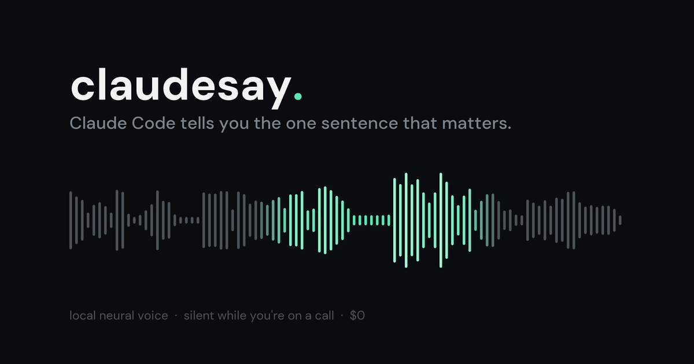

<p align="center">
  
</p>

# claudesay

[](https://github.com/abryfs/claudesay/actions/workflows/test.yml)
[](https://github.com/abryfs/claudesay/releases)
[](LICENSE)


**Claude Code tells you the one sentence that matters.** A single bash hook that speaks the meaningful end of a reply when the turn finishes — and stays quiet the rest of the time. It won't talk over a meeting, and it won't talk over itself.

## Hear it

Same sentence through both engines — built-in `say` first, then the local neural voice. Press play:

<video src="https://github.com/abryfs/claudesay/raw/main/samples/0-comparison.mp4" controls width="100%"></video>

Prefer the raw files: [**comparison.mp3**](samples/0-comparison.mp3) · [`say` alone](samples/1-say-samantha.mp3) · [neural alone](samples/2-kokoro-af-heart.mp3). Or straight from a terminal, no clone:

```bash
curl -fsSL https://raw.githubusercontent.com/abryfs/claudesay/main/samples/0-comparison.mp3 \
  -o /tmp/claudesay-demo.mp3 && afplay /tmp/claudesay-demo.mp3
```

Both clips are loudness-normalized to −16 LUFS, so you're judging the voices and not the volume. Neither came from a demo script — they're `say -v Samantha` and a `POST /speak` to the same voice server the hook uses.

## Install

```bash
curl -fsSL https://raw.githubusercontent.com/abryfs/claudesay/main/install.sh | bash
```

Then open a new Claude Code session and ask it something. When the reply ends, you'll hear the last sentence.

<details>
<summary>Other ways to install (non-interactive, specific voice, from a clone, or via Claude Code itself)</summary>

```bash
# Non-interactive, default voice
curl -fsSL .../install.sh | bash -s -- --no-picker

# Non-interactive, specific voice
curl -fsSL .../install.sh | bash -s -- --voice=Daniel

# From a clone
git clone https://github.com/abryfs/claudesay && cd claudesay && ./install.sh
```

Run in a real terminal, the installer opens an arrow-key voice picker that previews each macOS voice live on highlight (↑↓ to audition, ⏎ to pick, `q` for the default). Without a TTY — including when Claude Code runs it for you — it falls back to `Samantha` unless you pass `--voice=`.

To have Claude Code install it, paste:

> Install claudesay (https://github.com/abryfs/claudesay) by running its install script with `--no-picker`, then confirm the Stop hook is wired in ~/.claude/settings.json.

**Manual install**, if you'd rather not run a script: copy `claudesay.sh`, `claudesay-voice.py` and `claudesay-mic.py` into `~/.claude/hooks/`, `chmod +x` them, and add the Stop hook block from [How it's wired](#how-its-wired).

</details>

Check it worked:

```bash
~/.claude/hooks/claudesay.sh --test          # speak a test sentence
~/.claude/hooks/claudesay.sh --mute-status   # is it muted?
```

## What it says, and what it refuses to say

Given this final message from Claude:

> I've updated the migration to backfill in batches of 500 instead of all at once, added an index on `events.team_id`, and re-ran the suite. **All three tests pass and the migration completed cleanly, so this is ready to deploy to staging whenever you want.**

claudesay speaks exactly the bolded sentence and nothing else. That's the whole editorial rule: **the last sentence, because that's where the verdict or the question lands.** You already read the setup on screen; the part you have to act on is the part worth saying out loud.

| Claude's response | claudesay |
|---|---|
| A long final summary | Speaks the **last sentence** |
| "Want me to deploy now?" | Speaks the **question** |
| "Let me check the logs." *(mid-pipeline filler)* | **Silent** |
| "Done." / "OK." *(trivial ack)* | **Silent** |
| The same response twice | **Silent** *(deduped on a content hash)* |
| Two Stops within 4s *(pipeline pause)* | **Silent** *(debounced)* |
| A tool-use-only turn *(no prose)* | **Silent** |
| You start typing while it speaks | **Cut off** *(barge-in)* |

<details>
<summary>How the filtering actually works</summary>

Four guards stack, cheapest first:

1. **`stop_hook_active` loop guard** — if a previous hook forced Claude to continue, skip, or we'd narrate the loop.
2. **Per-session debounce** — collapses Stop events within `CLAUDESAY_DEBOUNCE` seconds of each other.
3. **Filler heuristic** — short messages (<120 chars) opening with `Let me`, `I'll`, `Now`, `Running`, `Checking`, `OK`, `Done` and friends (smart-quote variants included) are transitional, not results.
4. **Content dedupe** — an md5 of the chosen text, so a repeated reply is spoken once.

What survives is stripped of markdown and ANSI escapes (so nothing reads literal asterisks or colour codes) and truncated to `CLAUDESAY_MAX`, then the last sentence of ≥15 chars is what gets spoken.

State lives in `${TMPDIR}/claudesay-<uid>/<session>.{last,hash,pid,job}` at mode `0700`, wiped on reboot.

</details>

## Staying out of your way

Three guards, each for a failure you can't take back once it happens.

### It goes silent when you're on a call

If a microphone is live, claudesay says nothing. No configuration, no list of meeting apps.

A notification during a meeting is broadcast to everyone listening, and you cannot un-say it — muting after the fact is already too late. So this is automatic, not opt-in.

The signal is CoreAudio's `DeviceIsRunningSomewhere`, the same flag behind the orange dot in your menu bar. It's true whenever any process holds an input stream, so Zoom, Meet, Teams, Slack huddles, Granola and QuickTime all work without claudesay knowing they exist. **It reads a property flag: it never opens a stream, captures nothing, and never triggers a microphone permission prompt.**

Two details that are load-bearing:

- **Every input device is checked, not just the default.** Measured on a MacBook Pro, opening the mic lit up device 95 while the default input was device 90 — a default-only check reported "idle" straight through a live capture.
- **It fails open.** If the probe can't answer, claudesay speaks. A detector that silently mutes you forever is the worse bug, because you'd never find out.

Disable with `CLAUDESAY_MUTE_WHEN_MIC=0`.

### Mute, from anywhere, with a hotkey

```bash
claudesay.sh --mute          # silence every session until you unmute
claudesay.sh --mute 45       # ...for 45 minutes, then it lifts itself
claudesay.sh --unmute
claudesay.sh --toggle-mute   # bind this to a hotkey
claudesay.sh --mute-status
```

Mute is machine-wide and live: it reaches sessions that are **already running** and stops whatever is speaking right now. It silences claudesay only — system volume, music and call audio are untouched.

**For a global hotkey that works when Claude isn't the focused app**, use Shortcuts (built into macOS, nothing to install):

1. Shortcuts → **+** → add **Run Shell Script**.
2. Script: `$HOME/.claude/hooks/claudesay.sh --toggle-mute`
3. Name it, then **⌘I** → *Add Keyboard Shortcut* → press your combination.

Prefer `--mute 45` over a bare toggle for meetings: the mute you forget to lift is the one that quietly turns the tool off for good.

### One voice at a time

Speech from different Claude Code sessions **queues** instead of overlapping.

Inside a single session the newest line still cuts off the previous one — that's barge-in, and it's what you want. Across sessions, lines wait their turn, because two sentences spoken at once are both lost. You can re-read a screen; you can't un-hear an overlap.

A line that can't get the floor within `CLAUDESAY_QUEUE_WAIT` seconds is dropped rather than queued forever — speech that arrives a minute late describes work you've already moved on from.

## The neural voice (optional)

`say` is instant and free but unmistakably synthetic. [Kokoro-82M](https://huggingface.co/hexgrad/Kokoro-82M) sounds far more natural and is also free; the catch is that it needs a model in memory. claudesay keeps it warm **only while you're working**, and never makes you wait for it.

```jsonc
// ~/.claude/settings.json
{ "env": { "CLAUDESAY_ENGINE": "kokoro" } }
```

Needs [`uv`](https://docs.astral.sh/uv/) (`brew install uv`) and Apple Silicon. Nothing else — the first run pulls the model into uv's and Hugging Face's own caches.

- **First turn after a quiet spell** is spoken by `say`, instantly, while the voice server warms in the background (~30s, once). You never wait on a model.
- **Every turn after that** is neural, in ~0.7s.
- **After 5 minutes of silence** the server exits and returns the memory.
- **Anything that goes wrong** — server down, synthesis error, timeout, no `uv` — falls back to `say`. The failure mode is a worse voice, never silence.

Measured on an M3 Pro, a 187-char sentence → 11.5s of speech:

| | `say` | `kokoro` |
|---|---|---|
| Time to audio | instant | **0.66s** warm · instant (via `say`) when cold |
| Resident memory | 0 | **~110–460 MB** warm, then flat · **0 when idle** |
| Peak during load | — | ~740 MB, once per warm-up |
| Cost | $0 | $0 |
| Network | none | model download, once |

```jsonc
{ "env": {
    "CLAUDESAY_ENGINE": "kokoro",
    "CLAUDESAY_KOKORO_VOICE": "af_bella",   // af_heart, af_bella, am_michael, …
    "CLAUDESAY_KOKORO_IDLE": "900"          // hold the model 15min instead of 5
} }
```

<details>
<summary>Why a server, and why MLX — the measurements behind those choices</summary>

**Why not one process per turn?** Because it's unusable. Synthesis is fast (~0.8s), but importing the ML stack and loading the model costs ~3s *every time*, so a fresh process per turn measured **~4s** before you hear anything. The server pays that once. Idle-exit is what stops "warm" from meaning "resident forever."

**Why MLX and not ONNX?** Same machine, same sentence: **MLX 0.76s · ONNX fp32 2.51s · ONNX int8 4.69s.** Two counter-intuitive results there — quantized int8 is *slower* than fp32 on Apple Silicon, and CoreML is slower than plain CPU because it can only claim a fraction of the graph (~1300 of ~3400 nodes), so partition overhead eats the win. MLX uses the GPU and wins by ~3.8×.

**Does it leak?** No. Memory settles rather than creeping: ~110 MB after a couple of utterances, rising to ~460 MB under sustained use and then holding flat (457 → 460 MB across 15 utterances).

</details>

## Configuration

Set these in `~/.claude/settings.json` under `env`, or in your shell.

| Variable | Default | What it does |
|---|---|---|
| `CLAUDESAY_ENGINE` | `say` | `say` or `kokoro`. An unrecognized value degrades to `say`. |
| `CLAUDESAY_VOICE` | `Samantha` | Any macOS voice. `say -v '?'` lists them. |
| `CLAUDESAY_RATE` | system | `say -r` words/min. Try `200`–`260` for snappier reads. |
| `CLAUDESAY_DEBOUNCE` | `4` | Seconds between fires per session. |
| `CLAUDESAY_MIN_LEN` | `40` | Skip messages shorter than this. |
| `CLAUDESAY_MAX` | `220` | Truncate spoken text to this many chars. |
| **Staying quiet** | | |
| `CLAUDESAY_MUTE_WHEN_MIC` | `1` | Stay silent while any microphone is live. `0` disables. |
| `CLAUDESAY_MIC_TTL` | `8` | Seconds to cache the mic check, so the hook stays fast. |
| `CLAUDESAY_MUTE_FILE` | `~/.claude/claudesay-muted` | Where the mute switch lives. |
| `CLAUDESAY_QUEUE_WAIT` | `30` | Max seconds a line waits behind another session before being dropped. |
| `CLAUDESAY_DISABLE` | unset | Set to anything to silence without uninstalling. |
| **Neural voice** | | |
| `CLAUDESAY_KOKORO_VOICE` | `af_heart` | Kokoro voice name. |
| `CLAUDESAY_KOKORO_IDLE` | `300` | Seconds of silence before the voice server exits. `0` never exits. |
| `CLAUDESAY_KOKORO_PORT` | `8787` | Loopback port for the voice server. |
| `CLAUDESAY_KOKORO_TIMEOUT` | `10` | Seconds to wait for synthesis before falling back to `say`. |
| **Debugging** | | |
| `CLAUDESAY_DEBUG` | unset | Print every decision the hook makes to stderr. |
| `CLAUDESAY_SILENT` | unset | Dry run: render speech to a file instead of playing it. |
| `CLAUDESAY_STATE` | per-user `$TMPDIR` | Override the state directory. |

## How it's wired

The installer adds a `Stop` hook to `~/.claude/settings.json`. **Use absolute paths** — Claude Code does not tilde-expand `command`:

```json
{
  "hooks": {
    "Stop": [{
      "hooks": [{
        "type": "command",
        "command": "/Users/<you>/.claude/hooks/claudesay.sh",
        "timeout": 15
      }]
    }]
  }
}
```

`Stop` fires when Claude finishes a turn. The hook reads the transcript path from stdin, takes the last text-bearing assistant message, and decides whether to speak it. `timeout: 15` is a safety floor; the hook itself returns in well under a second.

Three files are installed: `claudesay.sh` (the hook), `claudesay-mic.py` (the meeting check) and `claudesay-voice.py` (the neural server, inert unless you enable it).

> **Note:** Stop hooks ignore a `matcher` field — Anthropic's docs say it's silently dropped, so claudesay omits it.

**Upgrading with sessions already open?** Claude Code reads hook config at session start, so running sessions keep calling whatever path they launched with. The installer forwards the old `voice-notify.sh` path to `claudesay.sh` rather than orphaning it, which puts those sessions on the current queue and mute switch without a restart.

**Uninstall:** `./uninstall.sh` — removes the hook entry, the three files, any running voice server, and the state directory.

## Troubleshooting

<details>
<summary>It never speaks</summary>

```bash
say -v Samantha "test"                       # 1. does say work at all?
~/.claude/hooks/claudesay.sh --mute-status   # 2. is it muted?
python3 ~/.claude/hooks/claudesay-mic.py; echo $?   # 3. 0 = a mic is live, so it's staying quiet on purpose
jq '.hooks.Stop' ~/.claude/settings.json     # 4. is the hook wired?

# 5. Replay your latest transcript with full tracing.
LATEST=$(ls -t ~/.claude/projects/*/*.jsonl | head -1)
echo "{\"transcript_path\":\"$LATEST\",\"session_id\":\"debug\",\"stop_hook_active\":false}" \
  | CLAUDESAY_DEBUG=1 bash ~/.claude/hooks/claudesay.sh
```

Silence is often correct: the message was under `CLAUDESAY_MIN_LEN`, was filler, was a duplicate, landed inside the debounce window, or a microphone was live. `CLAUDESAY_DEBUG=1` names the reason on every fire.

</details>

<details>
<summary>The neural voice won't start</summary>

```bash
command -v uv || brew install uv                        # 1. uv present?
CLAUDESAY_ENGINE=kokoro ~/.claude/hooks/claudesay.sh --test   # 2. is the server warm?
cat "${TMPDIR}/claudesay-$(id -u)/voice.log"            # 3. what did it say?
curl -sS http://127.0.0.1:8787/health                   # 4. is it listening?
```

The first `--test` after a quiet spell always reports "cold" and speaks via `say` — that's the design, not a fault. Wait ~30s and run it again. If it's still cold, the log says why (usually `uv` missing or a failed model download).

</details>

<details>
<summary>settings.json got mangled, or the picker left my terminal weird</summary>

The installer writes a timestamped backup before touching anything, and refuses to edit a `settings.json` that isn't valid JSON:

```bash
cp "$(ls -t ~/.claude/settings.json.bak.* | head -1)" ~/.claude/settings.json
stty sane && tput cnorm      # if the voice picker exited badly
```

</details>

## Why this one

Claude Code still ships **no native TTS** ([#50720](https://github.com/anthropics/claude-code/issues/50720) is open). Most alternatives ask for an API key and per-call billing, install a daemon or MCP server, or say "Done" so often you turn them off within a day.

- **One readable bash file.** Read it, audit it, change it.
- **macOS built-ins by default** — `say` + `jq`.
- **Quiet unless it's worth hearing.** The filtering is the product.
- **$0 forever**, neural voice included. No key, no quota.
- **A better voice never costs latency or idle RAM.** Kokoro is opt-in, warms in the background, exits when you stop.
- **Security-conscious.** Validates `$VOICE` argv against flag injection, keeps state in a private per-user dir (not world-writable `/tmp`), refuses to write through symlinked state files, sends synthesis text via stdin so a reply starting with `@` can't make curl read a local file, and atomic-renames `settings.json`.

Versus the neighbours:

- **`say` straight in `settings.json`** — no transcript awareness, no debounce, no filler filter. You'll hear "Done" fifty times an hour.
- **[peon-ping](https://github.com/PeonPing/peon-ping)** — sound effects, not speech. Different niche.
- **[VoiceMode](https://github.com/mbailey/voicemode)** — full two-way conversation over MCP + Whisper. Heavier. Use it if you want duplex.
- **[AgentVibes](https://github.com/paulpreibisch/AgentVibes)** — 904 Piper voices, per-LLM routing, FX. Use it if you want the kitchen sink.
- **[claude-code-tts](https://github.com/ktaletsk/claude-code-tts)** — same model, per-turn CLI, so it pays model load on every single turn.
- **[Kokoro-FastAPI](https://github.com/remsky/Kokoro-FastAPI)** — a fine general-purpose Kokoro server, but it's a container you start and it stays resident. claudesay's starts and exits itself.

## Requirements

- macOS, Apple Silicon for the neural voice (Intel stays on `say`)
- `jq` — `brew install jq`
- `python3` — ships with macOS; used for the mic check, stdlib only
- Claude Code 2.x (tested on 2.1.123)
- [`uv`](https://docs.astral.sh/uv/) — only if you enable the neural voice

Linux/Windows ports welcome: see `claudesay.sh` for the contract and swap the `say` call for `espeak-ng` or PowerShell's `SpeechSynthesizer`.

## Contributing

```bash
./tests.sh                              # 45 tests, silent — renders instead of playing
CLAUDESAY_AUDIBLE_TESTS=1 ./tests.sh    # let it use the speakers
```

The suite is silent by default on purpose: it's developed on a laptop that also joins meetings, and an early version once talked over a live call. See [CONTRIBUTING.md](CONTRIBUTING.md).

## License

MIT — see [LICENSE](LICENSE).
